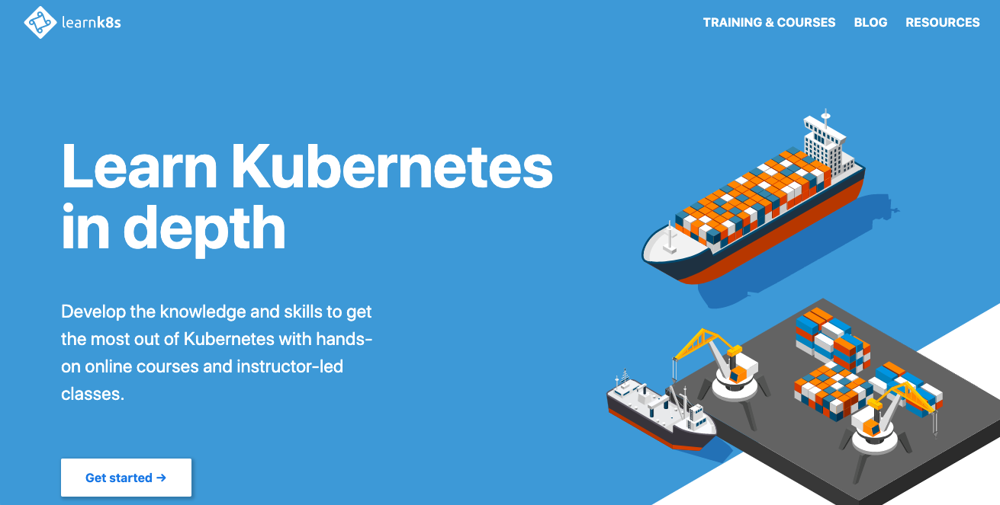
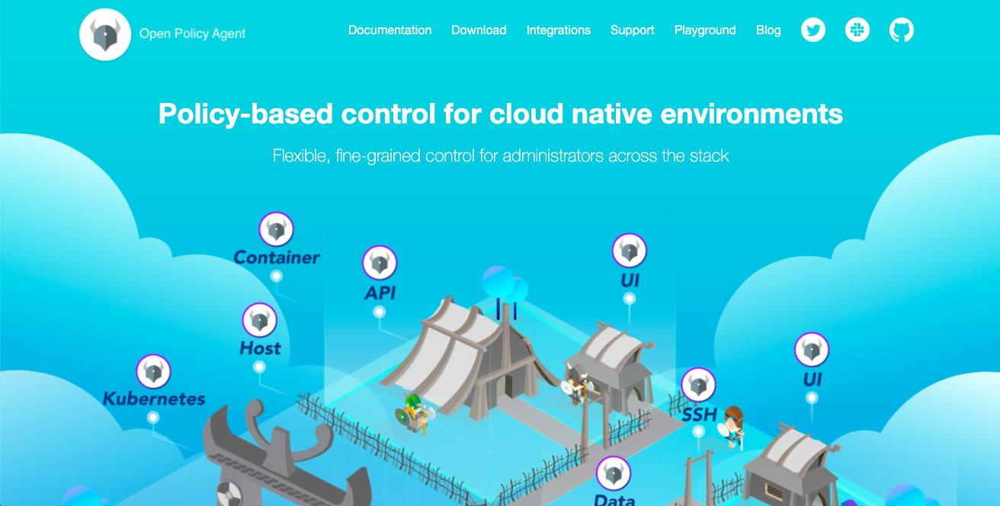
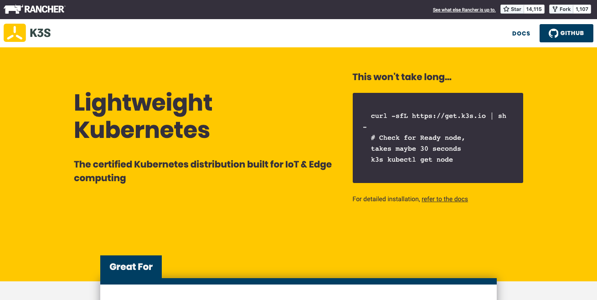
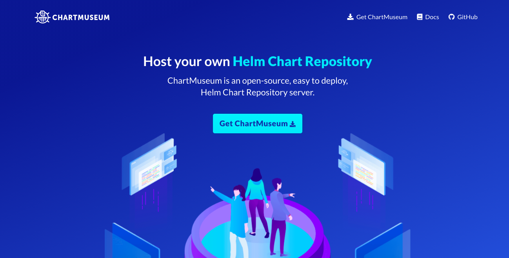
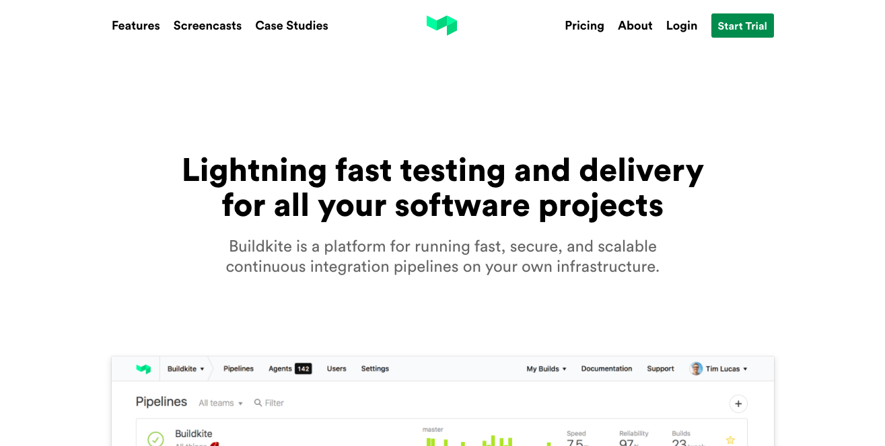
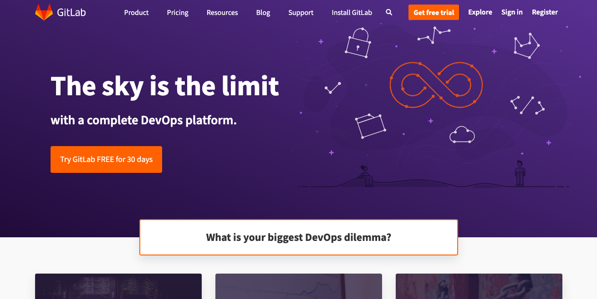
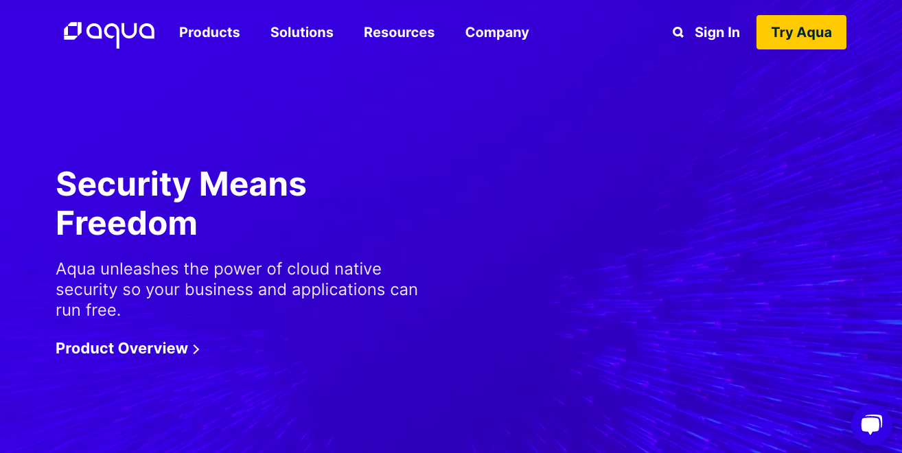
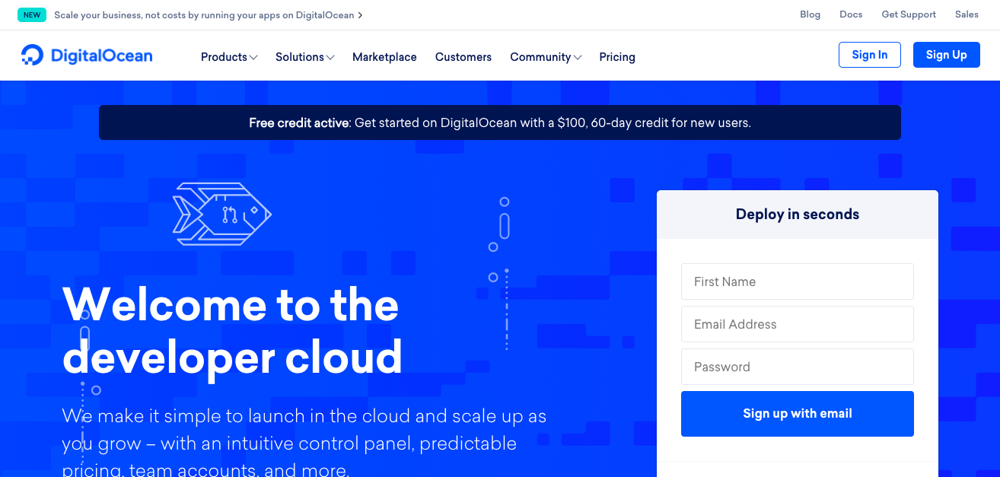
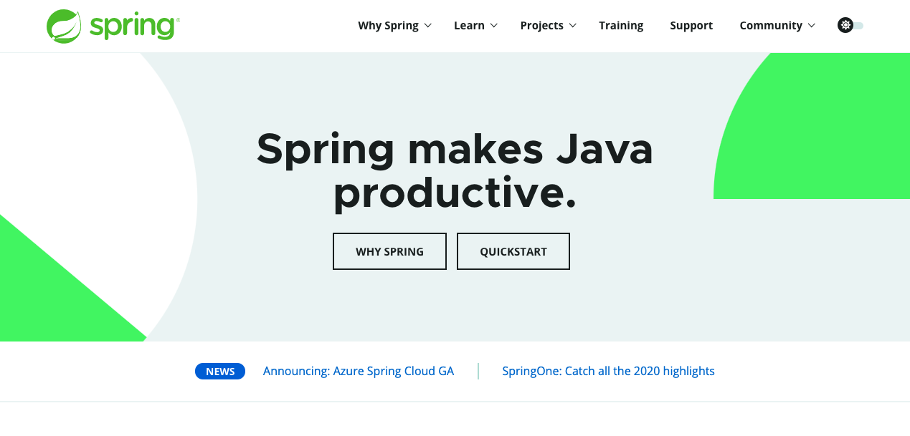
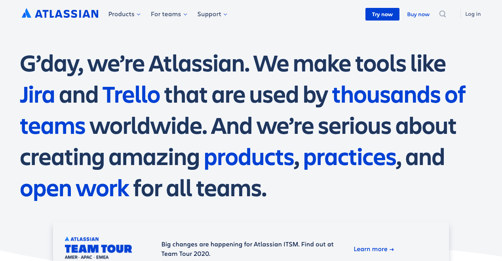

# Websites

A collection of cool website designs.

## Learnk8s

<https://learnk8s.io/> | 2020-09-10

## Harbor

<https://goharbor.io/> | 2020-09-10

## Open Policy Agent

<https://www.openpolicyagent.org/> | 2020-09-10

## K3s

<https://www.k3s.io/> | 2020-09-12

## ChartMuseum

<https://chartmuseum.com/> | 2020-09-15

## Buildkite

<https://buildkite.com/> | 2020-09-16

## GitLab

<https://about.gitlab.com/> | 2020-09-16

## Aqua

<https://https://www.aquasec.com/> | 2020-09-16

## DigitalOcean

<https://www.digitalocean.com/> | 2020-09-18

## Spring

<https://spring.io/> | 2020-09-23

## Atlassian

<https://www.atlassian.com/> | 2020-09-23
